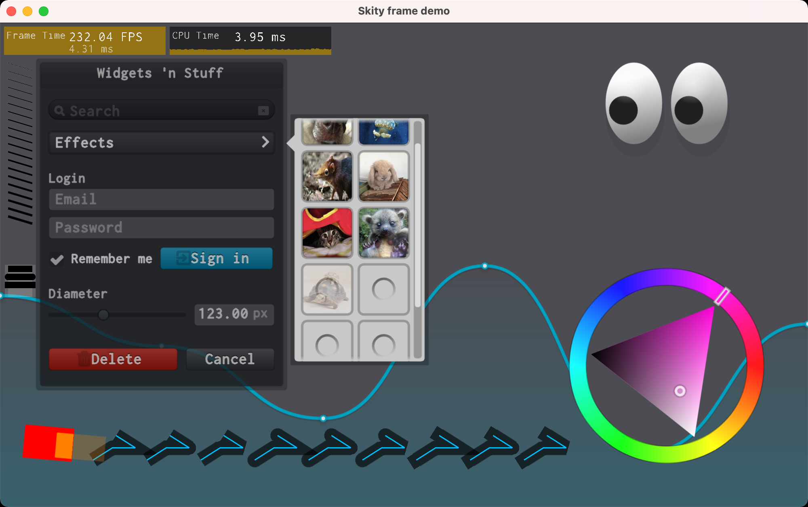
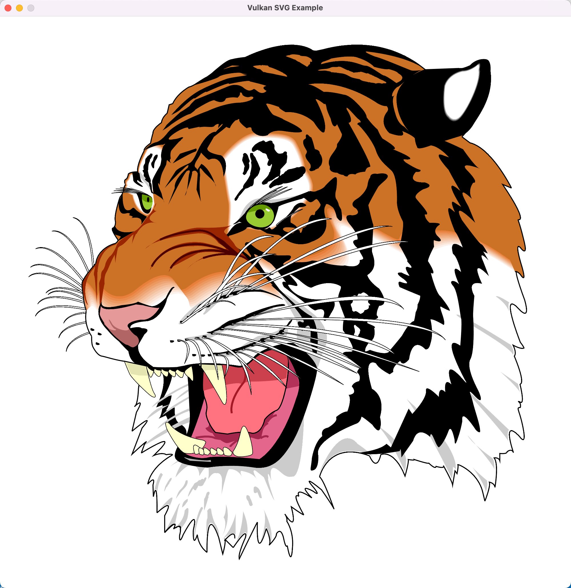
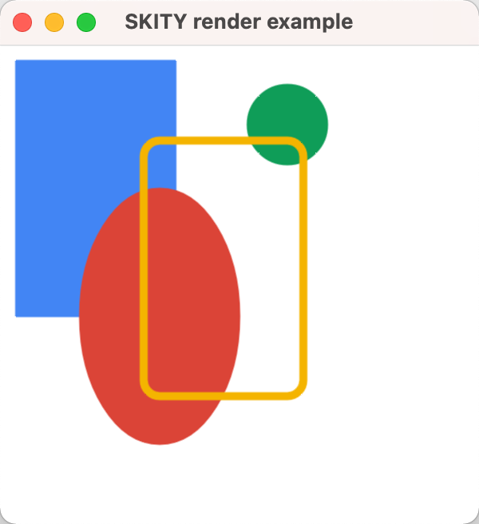

# OpenGL Vector Graphics

`Skity` is an open-source 2D graphics library written in `c++` using [OpenGL](https://www.opengl.org) and [Vulkan (WIP)](https://www.vulkan.org/) as backend.
Its **API** follows the same pattern as [Skia](https://skia.org/) and implements the rendering by myself. <br/>

## Example

Working in progress nanovg demo <br/>



Parse and render svg file: [tiger.svg](./example/images/tiger.svg)


same as [skia demo](https://fiddle.skia.org/c/66a829e00c752fe96e2ef4195cdc5454)<br/>
code is [example.cc](./example/example.cc)
<br/>


## Simple Demo


## Build

### Third party dependencies

- [glad](https://glad.dav1d.de/)
  Uesd in example for OpenGL context creation
- [glm](https://github.com/g-truc/glm.git)
  Used in this library for all geometric mathematical claculations
- [gtest](https://github.com/google/googletest.git)
  Used in test for some unit test only used when build for debug
- [pugixml](https://github.com/zeux/pugixml.git)
  Used in this library for xml parse when drawing svg image. It will removed to a module directory in future
- [spdlog](https://github.com/gabime/spdlog.git)
  Used in this library for logging. (Optional can trun off by setting `ENABLE_LOG=OFF`)
- [VulkanMemoryAllocator](https://github.com/GPUOpen-LibrariesAndSDKs/VulkanMemoryAllocator.git)
  Used when enable `VULKAN_BACKEND` for internal memory management

### CMake options

- `ENABLE_LOG` enable logging for this library, default value is `ON`. If turn off the [spdlog](https://github.com/gabime/spdlog.git) is no longer needed.
- `VULKAN_BACKEND` enable [Vulkan](https://www.vulkan.org/) backend, default value is `OFF`. If turn on, the [VulkanMemoryAllocator](https://github.com/GPUOpen-LibrariesAndSDKs/VulkanMemoryAllocator.git) dependence is needed.
- `OPENGL_BACKEND` enable [OpenGL](https://www.opengl.org) backend, default value is `ON`.

### Requirements

- CMake
- [Freetype](https://www.freetype.org/)
- [GLFW](https://www.glfw.org/): for build test and example
- optional
  - [libpng](http://www.libpng.org/pub/png/libpng.html): for png file decode
  - [libjpeg-turbo](https://www.libjpeg-turbo.org/): for jpg file decode
  - on windows ,need to set `JPEG_PREFIX=path to libjpeg installed directory` environment value

```shell
# fetch sources from github
git clone --recursive https://github.com/RuiwenTang/Skity.git
cd Skity
# Create build directory
mkdir build
cd build
cmake ..
make
```

## Current status:

- Fill (only stencil, no even-odd support)

- Stroke (done)

- Clip (stencil)

- Font (in progress)

  - draw simple text, no glyph cache, no text layout

- Line caps and joins (done)

- PathEffect dash (in progress, fill with aa is not working)

  - implement a simple discrete path effect
  - implement a path measure algorithm and dash path effect

- Image (in progress)

  - Cocec interface
  - png image decode (need install [libpng](http://www.libpng.org/pub/png/libpng.html))
  - jpg image decode (need install [libjpeg-turbo](https://www.libjpeg-turbo.org/))

- SVG (in progress)
  - basic svg tag parser
    - `<svg>` `<g>` `<path>` `<circle>` `<rect>`

## Reference

- [GPU-accelerated Path Rendering](./resources/gpupathrender.pdf)
- [Resolution Independent Curve Rendering using Programmable Graphics Hardware](./resources/p1000-loop.pdf)

## TODO

- Vulkan backend support (working in progress)

- CPU backend support (planning)

- Support [lottie](https://airbnb.design/lottie/) anmiation.

- Support mask filters like [SkMaskFilter](https://api.skia.org/classSkMaskFilter.html)
