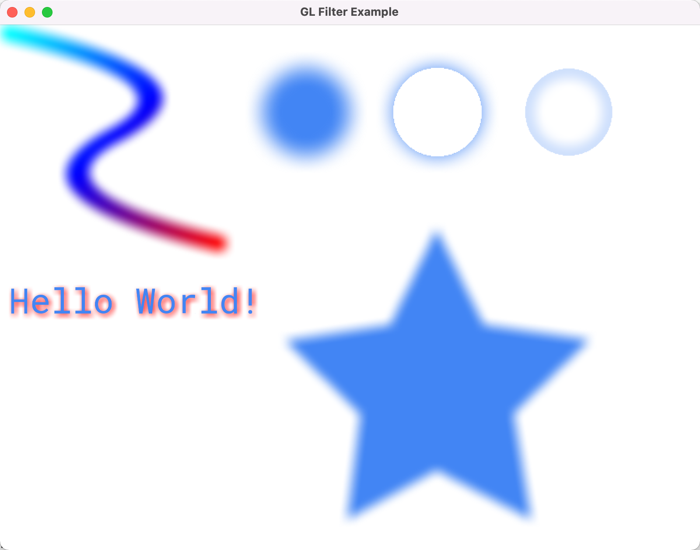

# Skity

`Skity` is an open-source 2D graphics library written in `c++` using [OpenGL](https://www.opengl.org) and [Vulkan (Experimental)](https://www.vulkan.org/) as backend.
Its **API** follows the same pattern as [Skia](https://skia.org/) and implements the rendering by myself. <br/>


[](https://www.codefactor.io/repository/github/ruiwentang/skity)
[](https://opensource.org/licenses/MIT)

## Screen Shots

| [Just like nanovg](./example/frame_example.cc)       | [SVG render](./example/svg_example.cc)          | [Basic Example](./example/example.cc)             | [Android Porting](https://github.com/RuiwenTang/Skity-Android)                                                                   |
| ---------------------------------------------------- | ----------------------------------------------- | ------------------------------------------------- | -------------------------------------------------------------------------------------------------------------------------------- |
|  |  |  |  |

| [Blur filter example](./example/filter_example.cc)       |
| -------------------------------------------------------- |
|  |

## Quick Start

### Initialization

The code below shows how to create a `skity::Canvas` instance using [GLFW](https://www.glfw.org/) with OpenGL backend. The full code can look at [gl_app.cc](./example/gl/gl_app.cc)

```c++
GLFWwindow* window = glfwCreateWindow(800, 600, "Demo", nullptr, nullptr);

int32_t pp_width, pp_height;
glfwGetFramebufferSize(window_, &pp_width, &pp_height);

float density = (float)(pp_width * pp_width + pp_height * pp_height) /
                  (float)(800 * 800 + 600 * 600);

skity::GPUContext ctx{skity::GPUBackendType::kOpenGL, (void*) glfwGetProcAddress};

auto canvas = skity::Canvas::MakeHardwareAccelationCanvas(800, 600, density, &ctx);
```

### Drawing Path

```c++
// paint controls the color and style when geometry is rendered
skity::Paint paint;
paint.setStyle(skity::Paint::kFill_Style);
paint.setColor(skity::ColorSetRGB(0x42, 0x85, 0xF4));

// create path
skity::Path path;
path.moveTo(199, 34);
path.lineTo(253, 143);
path.lineTo(374, 160);
path.lineTo(287, 244);
path.lineTo(307, 365);
path.lineTo(199, 309);
path.lineTo(97, 365);
path.lineTo(112, 245);
path.lineTo(26, 161);
path.lineTo(146, 143);
path.close();

canvas->drawPath(path, paint);
```

The code generates the following result:

<p align="center">
  
</p>

### Blur Effect

By using [`MaskFilter`](./include/skity/effect/mask_filter.hpp), can make some **Post-processing** effect, currently only support [Blur](https://en.wikipedia.org/wiki/Blur) effect.

```c++
paint.setMaskFilter(
      skity::MaskFilter::MakeBlur(skity::BlurStyle::kNormal, 10.f));

canvas->drawPath(path /* previouse created star path */, paint);

```

<p align="center">
  
</p>

## Build

### Third party dependencies

- [glad](https://glad.dav1d.de/)
  Uesd in example for OpenGL context creation
- [glm](https://github.com/g-truc/glm.git)
  Used in this library for all geometric mathematical claculations
- [gtest](https://github.com/google/googletest.git)
  Used in test for some unit test only used when build for debug
- [pugixml](https://github.com/zeux/pugixml.git)
  Used in this library for xml parse when drawing svg image.
- [spdlog](https://github.com/gabime/spdlog.git)
  Used in this library for logging. (Optional can trun off by setting `ENABLE_LOG=OFF`)
- [VulkanMemoryAllocator](https://github.com/GPUOpen-LibrariesAndSDKs/VulkanMemoryAllocator.git)
  Used when enable `VULKAN_BACKEND` for internal memory management

### CMake options

| CMake Option         | Default Value | Description                                                                                                                                                                            |
| -------------------- | ------------- | -------------------------------------------------------------------------------------------------------------------------------------------------------------------------------------- |
| **ENABLE_LOG**       | ON            | Enable logging. If turn off the [spdlog](https://github.com/gabime/spdlog.git) is no longer needed.                                                                                    |
| **VULKAN_BACKEND**   | OFF           | Enable [Vulkan](https://www.vulkan.org/) backend. If turn on, the [VulkanMemoryAllocator](https://github.com/GPUOpen-LibrariesAndSDKs/VulkanMemoryAllocator.git) dependence is needed. |
| **OPENGL_BACKEND**   | ON            | Enable [OpenGL](https://www.opengl.org) backend                                                                                                                                        |
| **BUILD_SVG_MODULE** | ON            | Build SVG module. If turn off the [pugixml](https://github.com/zeux/pugixml.git) is no longer needed.                                                                                  |
| **BUILD_EXAMPLE**    | ON            | Build [example code](./example/). Need [GLFW](https://www.glfw.org/) .                                                                                                                 |
| **BUILD_TEST**       | ON            | Build [test code](./test)                                                                                                                                                              |

### Requirements

- CMake
- [Freetype](https://www.freetype.org/): If not present, font rendering will not working
- [GLFW](https://www.glfw.org/): for build test and example
- optional
  - [libpng](http://www.libpng.org/pub/png/libpng.html): for png file decode
  - [libjpeg-turbo](https://www.libjpeg-turbo.org/): for jpg file decode
  - on windows ,need to set environment value: `JPEG_PREFIX=path to libjpeg installed directory`

```shell
# fetch sources from github
git clone --recursive https://github.com/RuiwenTang/Skity.git
cd Skity
# Create build directory
mkdir build
cd build
cmake ..
make
```

## Current status:

- Fill (only stencil, no even-odd support)

- Stroke (done)

- Clip (stencil)

- Font (basic drawing api)

  - draw simple text, no glyph cache, no text layout

- Line caps and joins (done)

- PathEffect dash

  - implement a simple discrete path effect
  - implement a path measure algorithm and dash path effect

- Image (in progress)

  - Cocec interface
  - png image decode (need install [libpng](http://www.libpng.org/pub/png/libpng.html))
  - jpg image decode (need install [libjpeg-turbo](https://www.libjpeg-turbo.org/))

- SVG (done)

  - basic svg tag parser
    - `<svg>` `<g>` `<path>` `<circle>` `<rect>`

- Maskfilter (done with Blur effect filter)
  - Gaussian Blur with inner and outer effect
    - OpenGL backend
      - Using FBO and off screen rendering to do blur calculation
    - Vulkan backend
      - Use compute shader to do blur calculation

## Reference

- [GPU-accelerated Path Rendering](./resources/gpupathrender.pdf)
- [Resolution Independent Curve Rendering using Programmable Graphics Hardware](./resources/p1000-loop.pdf)

## TODO

- [x] Vulkan backend support (Experimental done)

- [ ] CPU backend support (planning)

- [ ] Support [lottie](https://airbnb.design/lottie/) anmiation.

- [x] Support mask filters like [SkMaskFilter](https://api.skia.org/classSkMaskFilter.html)
