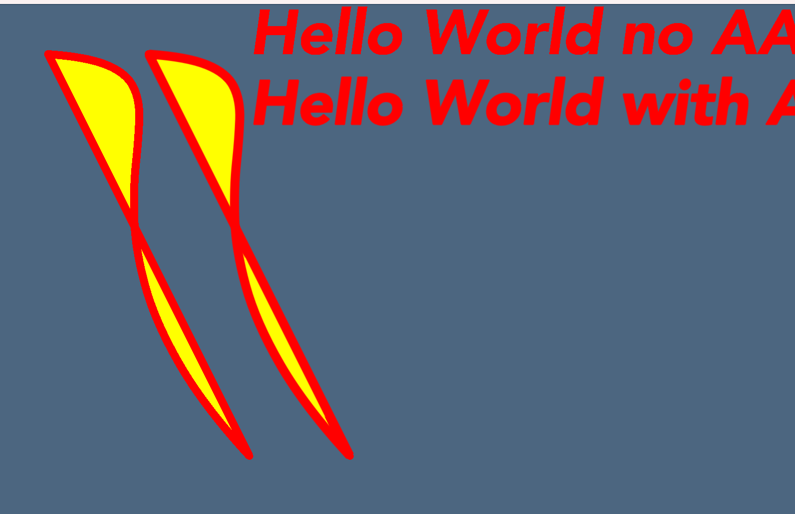

# OpenGL Vector Graphics
`Skity` is an open-source 2D graphics library written in `c++` using [OpenGL](https://www.opengl.org) as backend. 
Its **API**  follows the same pattern as [Skia](https://skia.org/) and implements the rendering by myself.  

## Example

same as [skia demo](https://fiddle.skia.org/c/66a829e00c752fe96e2ef4195cdc5454) 
 

## Simple Demo

## Anti-Alias test

## Current status:

- Fill (only stencil, no even-odd support)

- Stroke (done)

- Clip (stenil)

- Font (in progress)

- Line caps and joins (done)

- PathEffect dash (in progress, fill with aa is not working)

  - implement a simple discrete path effect

- Image (in progress)
