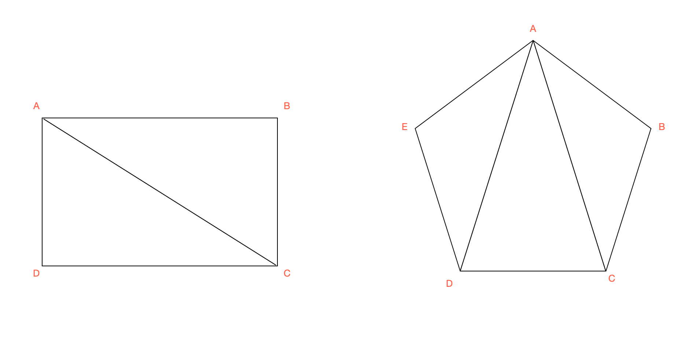
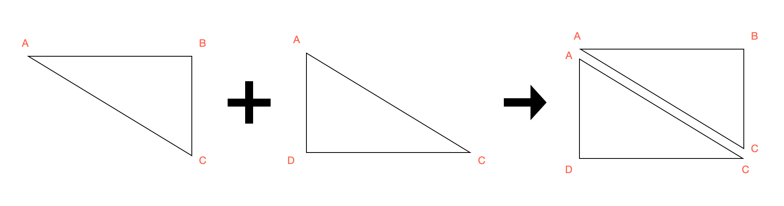
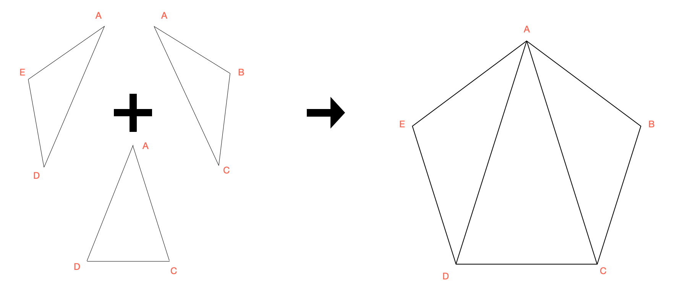
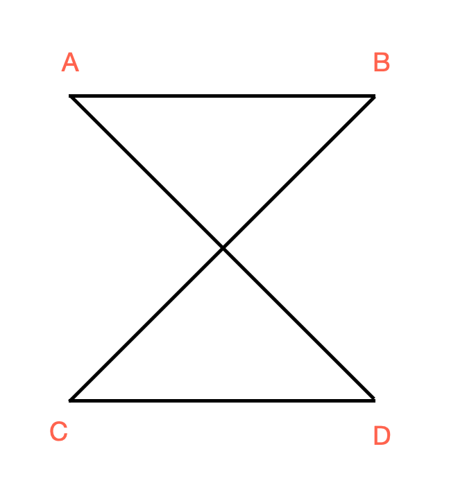
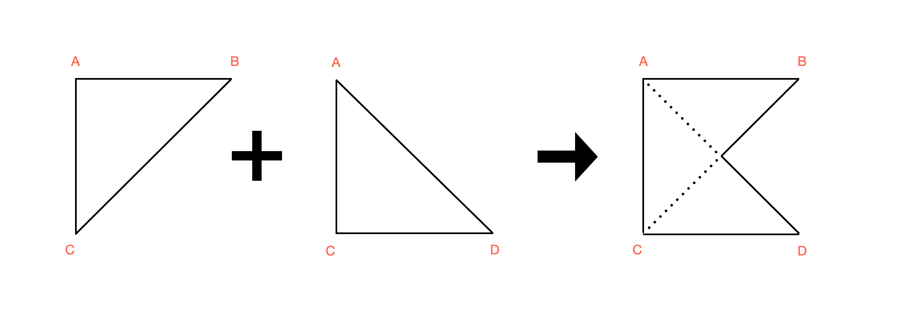
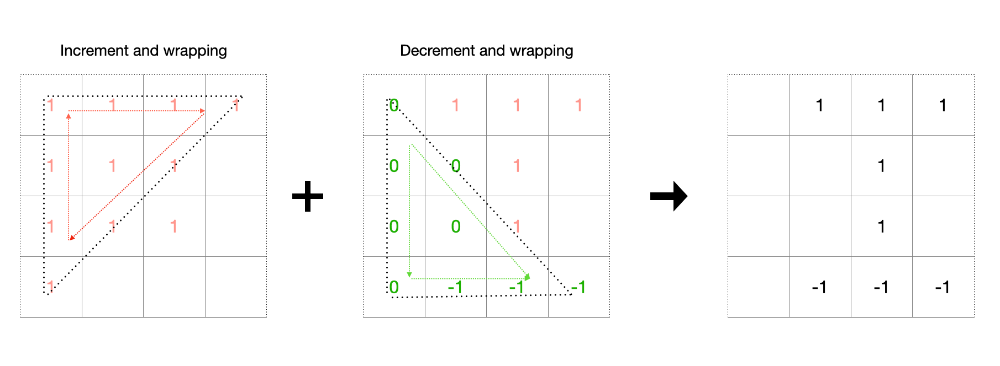
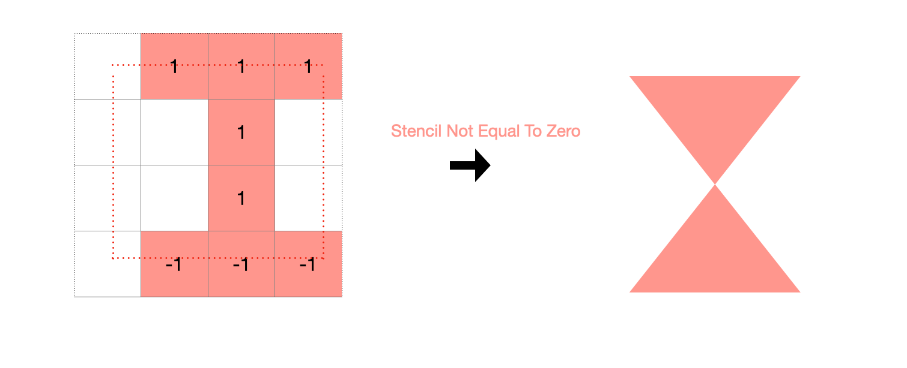

### About

Skity is a light weight library for drawing 2D Vector Image in GPU context, currently it support OpenGL(3.3) OpenGLES 3.0 and Vulkan. The public API follows the same pattern as [Skia](https://skia.org/) but the backend render code is implement by myself.

### How it works

The answer is [Stencil buffer](https://en.wikipedia.org/wiki/Stencil_buffer). Yes, the core magic inside this library is using **Stencil buffer**. Instead of using complex geometric algorithms, all geometry processing is using a **Stencil buffer**.

### Filling Convex Polygon with GPU and Triangles

In most GPU graphics API, the basic drawing unit is the triangle. So first, let's use triangles to generate some [Convex Polygon](https://en.wikipedia.org/wiki/Convex_polygon).

    

For `Convex Polygon` like above, pick a point first, go through every edge from this point along a drection (ClockWise or CountClockWise), and fill the triangle made by the first point and the edge's endpoints.

    

    

### Filling Complex Polygon with GPU and Stencil Buffer

When with `Complex Polygon`, things become a little tricky. Like below, let's look at a [Complex Polygon](https://en.wikipedia.org/wiki/Complex_polygon).

    

If we using the same way as we used when during with `Convex Polygon`. We will get a wrong render result like below.

    

Many algorithms can solve this problem, but in this library, we will use `Stencil Buffer` to help us discard some parts inside a triangle that we don't want.

Before using `Stencil Buffer.` Let's talk about the direction of the edge first. As we can see, if starting from the first point, all boundaries follow the same direction(like all convert points are turning left or right), it is a `Convex Polygon,` which is why we can use triangles or [Trangle fan](https://en.wikipedia.org/wiki/Triangle_fan) to get the correct render result. But if some boundaries follow a different direction, it is a [Concave Polygon](https://en.wikipedia.org/wiki/Concave_polygon). That is why we got the wrong filling result.

When dealing with `Complex Polygon.` We need two steps to get the correct filling result:

- **Step 1** Using `Triangle Fan` to fill polygon, but in this step,  the output is not color but is stencil value based on the edge's direction.    
For example, if the edge's direction is `ClockWise,`  we use `increment and wrapping` logic(like `GL_INCR_WRAP` in OpenGL) to modify the stencil value. And if the direction is `CountClockWise.` using `decrement and wrapping` logic(like `GL_DESC_WRAP` in OpenGL).

    

- **Step 2** Filling the `Triangle Fan` or just the bounding box of this polygon with `Stencil Test.` By checking the stencil value `Not Equal to Zero.` And we get the correct filling result.

    

> The sample code can look at this [raw_gl_render_test.cc](https://github.com/RuiwenTang/Skity/blob/cf145bb50f7bd3995da74da82a732c08986e2ac7/test/raw_gl_render_test.cc).

### Filling Polygon with Curved edge

TBD
