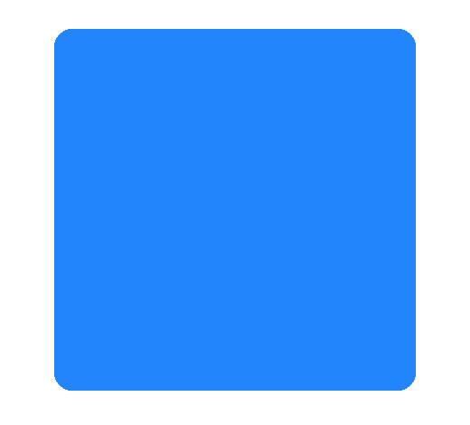
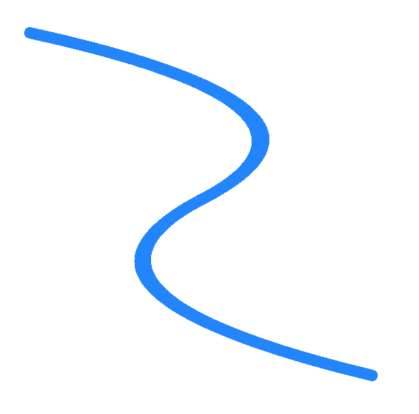

# Skity: 2D Vector Graphic Library

## Introduction

Skity is a 2D vector graphic render library writing in c++. The API follows the same pattern as [Skia](https://skia.org/) and implements the backend rendering by myself. Currently it can run on OpenGL and Vulkan context.

## Build and Install

### Option A: Build from source

#### Requirements

- CMake
- [Freetype](https://www.freetype.org/): If not present, font rendering will not working
- optional
  - [libpng](http://www.libpng.org/pub/png/libpng.html): for png file decode
  - [libjpeg-turbo](https://www.libjpeg-turbo.org/): for jpg file decode
  - on windows ,need to set environment value: `JPEG_PREFIX=path to libjpeg installed directory`

```shell
# fetch sources from github
git clone --recursive https://github.com/RuiwenTang/Skity.git
cd Skity
# Create build directory
mkdir build
cd build
cmake ..
make
make install
```

### Option B: Using [`vcpkg`](https://github.com/microsoft/vcpkg)

The port config is located in [vcpkg-skity](https://github.com/RuiwenTang/vcpkg-skity).

#### Using [manifest mode](https://github.com/microsoft/vcpkg/blob/master/docs/users/manifests.md)

Add the following registry info to vcpkg-configuration.json as a git [registry](https://github.com/microsoft/vcpkg/blob/master/docs/users/registries.md):

```
{
  "registries": [
    {
      "kind": "git",
      "repository": "https://github.com/RuiwenTang/vcpkg-skity.git",
      "baseline": "cf125cc8a08423432b70c240cfdd66e7002abbbf",
      "packages": [ "skity" ]
    }
  ]
}
```

And then add `skity` to vcpkg.json as a dependency:

```
{
  "name": "my-application",
  "version-string": "0.1.0",
  "dependencies": [
    "skity"
  ]
}
```

#### Using overlay-ports

Clone [vcpkg-skity repo](https://github.com/RuiwenTang/vcpkg-skity) and pass a [port-overlay](https://github.com/microsoft/vcpkg/blob/master/docs/specifications/ports-overlay.md) to vcpkg:

```
vcpkg install skity --overlay-ports=/path/to/vcpkg-skity/ports/skity
```

### Linking in CMake

In CMakeLists.txt, find and link skity:

```
find_package(skity CONFIG REQUIRED)
target_link_library(main skity::skity)
```

### Brief Overview


To use Skity just include the header file in sources code.

```c++
#include <skity/skity.hpp>
```

#### Initialization

The first thing need to do is crerating a `skity::Canvas` instance.The code below shows how to do it using [GLFW](https://www.glfw.org/) with OpenGL backend. The full code can look at [gl_app.cc](https://github.com/RuiwenTang/Skity/blob/main/example/gl/gl_app.cc)

```c++
GLFWwindow* window = glfwCreateWindow(800, 600, "Demo", nullptr, nullptr);

int32_t pp_width, pp_height;
glfwGetFramebufferSize(window_, &pp_width, &pp_height);

float density = (float)(pp_width * pp_width + pp_height * pp_height) /
                  (float)(800 * 800 + 600 * 600);

skity::GPUContext ctx{
    skity::GPUBackendType::kOpenGL,
    (void*) glfwGetProcAddress,
  };

auto canvas = skity::Canvas::MakeHardwareAccelationCanvas(800, 600,
                                                        density, &ctx);
```

- The first two parameters `width` and `height` are the size information for target which is canvas will render into.
- The third parameter is the pixel density of the current phisycal device.
- The last parameter is depends on what gpu context is used. For OpenGL context, just pass a `skity::GPUContext*` and pass a function pointer for [OpenGL Loading Function](https://www.khronos.org/opengl/wiki/Load_OpenGL_Functions), since Skity not link OpenGL library in compile time, it will use this function to load needed functions in runtime.

#### Basic Usage

##### Shapes

```c++
// paint controls the color and style when geometry is rendered,
skity::Paint paint;
paint.setStyle(skity::Paint::kFill_Style);
paint.setColor(skity::ColorSetRGB(0x42, 0x85, 0xF4));
// create a rectangle shape
auto rect = skity::Rect::MakeXYWH(10, 10, 100, 160);
// draw a rounded rectangle
canvas->drawRoundRect(rect, 10, 10, paint);
```
The result of above code looks as follows:
<p align="center">
    
</p>

##### Paths
```c++
skity::Paint paint;
paint.setStyle(skity::Paint::kFill_Style);
paint.setColor(skity::ColorSetRGB(0x42, 0x85, 0xF4));

// create path
skity::Path path;
path.moveTo(199, 34);
path.lineTo(253, 143);
path.lineTo(374, 160);
path.lineTo(287, 244);
path.lineTo(307, 365);
path.lineTo(199, 309);
path.lineTo(97, 365);
path.lineTo(112, 245);
path.lineTo(26, 161);
path.lineTo(146, 143);
path.close();

canvas->drawPath(path, paint);
```
By using the Path, lines and Bezier curves can be drawn. And the code will render a star shape as follow:

<p align="center">
    
</p>

##### Stroke Bézier Curves
```c++
skity::Paint paint;
paint.setStyle(skity::Paint::kStroke_Style);
paint.setStrokeWidth(8);
paint.setColor(0xff4285F4);
paint.setStrokeCap(skity::Paint::kRound_Cap);

skity::Path path;
path.moveTo(10, 10);
path.quadTo(256, 64, 128, 128);
path.quadTo(10, 192, 250, 250);
canvas->drawPath(path, paint);
```
Paint can control line cap and stroke width, the above code shoud render a bezier curve like below:

<p align="center">
    
</p>

#### More Examples

Can find the example code under [example](https://github.com/RuiwenTang/Skity/tree/main/example) directory

